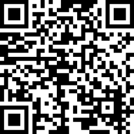

  

# Spotify Cookie Extractor For Spotube

## Table of Contents

- [Description](#description)
- [Features](#features)
- [Installation](#installation)
  - [Method 1: Installation via Chrome Web Store](#method-1-installation-via-chrome-web-store)
  - [Method 2: Manual Installation](#method-2-manual-installation)
- [Usage](#usage)
- [License](#license)
- [Contributors](#contributors)
- [More Information](#more-information)
- [Privacy Policy](#privacy-policy)
- [Support](#support)
  - [Buy Me a Coffee](#)
  - [Donate via PayPal](#)
  - [QR Codes for Donations](#)

## Description

This Chrome extension allows you to automatically extract Spotify cookies for use in the open-source music player Spotube. With Spotube, you can listen to music for free without needing a Spotify Premium subscription.

## Features

- Automatic extraction of Spotify cookies
- Easy integration with Spotube
- Open-source and freely available

## Installation

### Method 1: Installation via Chrome Web Store

I am excited to announce that the Spotify Cookie Extractor extension is now available on the Chrome Web Store! With just a few clicks, you can install the extension directly into your Chrome browser and start using it immediately.

#### Benefits of Installing from the Chrome Web Store:

- **Easy and Fast**: Installation is just one click away, with no need to manually download or unzip files.
- **Automatic Updates**: Receive the latest updates and improvements automatically, without any effort on your part.
- **Verified Security**: The extension has been reviewed by Google, ensuring a secure user experience.

#### Installation Steps:

1. Visit the [Spotify Cookie Extractor page on the Chrome Web Store](https://chromewebstore.google.com/detail/spotify-cookie-extractor/dhdniodhdmgapeeeokimkejdkpgkfhlj).
2. Click the "Add to Chrome" button.
3. Confirm the installation by clicking "Add extension".

#### Extension Details:

- **Version**: 1.0.0.1
- **Updated on**: June 24, 2024
- **Offered by**: Strategus One
- **Size**: 155KiB
- **Languages**: English
- **Website**: [Strategus One](https://strategus.one)

With this extension, you can seamlessly extract the 'sp_dc' cookies from Spotify and use them in Spotube to enjoy your music without needing a Spotify Premium subscription.

Install the extension today and experience the full functionality of Spotube with minimal effort!

### Method 2: Manual Installation

1. Download the latest version of this extension as a ZIP file from the [Releases page](https://github.com/YourUsername/Spotify-Cookie-Extractor/releases).
2. Unzip the ZIP file.
3. Open the Chrome browser and go to `chrome://extensions/`.
4. Enable Developer mode (toggle switch in the upper right).
5. Click on "Load unpacked" and select the unzipped folder.

## Usage

1. Install the extension following the instructions above.
2. Open Spotube and use the extracted Spotify cookies to log in and listen to music.

## License

This project is licensed under the MIT License – see the [LICENSE](LICENSE) file for details.

## Contributors

- **Silvan Fülle**
  - [Strategus One](https://strategus.one)
  - [Walkür Technology](https://walkuer.tech)
  - [NN Crew](https://nn-crew.cc)

## More Information

Visit the [Spotube project page on GitHub](https://github.com/KRTirtho/spotube) for more information about Spotube.

==============================

## [Privacy Policy](#privacy-policy)

**Privacy Policy for Spotify Cookie Extractor for Spotube**

The Spotify Cookie Extractor for Spotube is designed to extract the 'sp_dc' cookies from Spotify and use them within the Spotube application. This extension does not collect, store, or transmit any personal data of users. All operations are performed locally within the user's browser.

### What the Extension Does:
- Extracts the 'sp_dc' cookie from the Spotify website when the user is logged in.
- Does not store or transmit cookies or any other data to external servers.
- Requires permissions only for the specific functions of the extension.

### Data Collected:
- None. The extension performs all functions locally and does not store any data.

### Purpose of Data Processing:
- Local extraction and usage of the 'sp_dc' cookie to enable Spotube to use the Spotify API.

### Privacy and Security:
- All data processing occurs locally on the user's device.
- No data is shared with third parties.
- No data is stored on servers.

For further information, users can contact the developers through the provided contact information on GitHub or the developer's website.

==============================

## Support

If you find this project useful and would like to support its development, consider buying me a coffee or a beer. Your support is greatly appreciated!

**Buy Me a Coffee:**

  

Or donate via **PayPal:**

  

